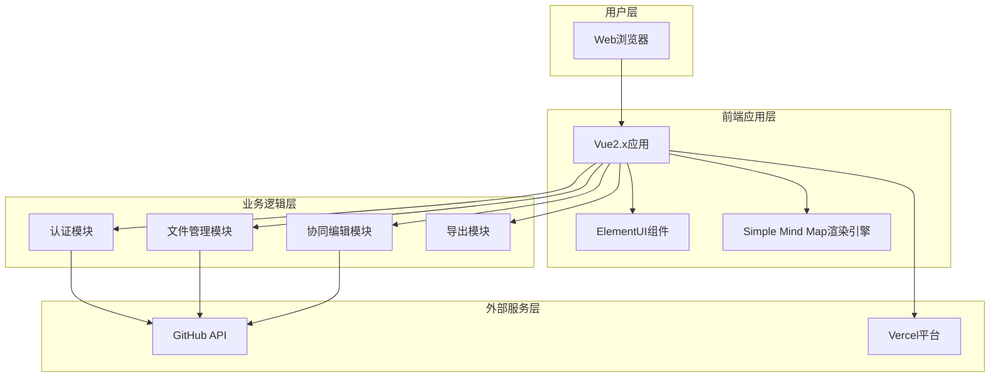

# 技术架构设计文档 - 在线思维导图产品

## 1. 架构概述

### 1.1 架构目标

* **可扩展性**: 支持模块化扩展，便于后续功能增强
* **高可用性**: 基于Vercel平台确保服务稳定性
* **可维护性**: 清晰的分层架构，便于代码维护

### 1.2 架构原则

* **单一职责原则**: 每个模块专注于特定功能
* **开闭原则**: 对扩展开放，对修改封闭
* **依赖倒置原则**: 依赖抽象而非具体实现

## 2. 系统架构

### 2.1 整体架构图



### 2.2 架构分层

#### 2.2.1 表示层

* **Vue2.x应用**: 主应用框架，负责页面路由和状态管理
* **ElementUI组件**: 提供UI组件库，确保界面一致性
* **Simple Mind Map**: 核心思维导图渲染引擎

#### 2.2.2 业务层

* **认证模块**: GitHub OAuth集成，用户身份管理
* **文件管理模块**: GitHub仓库文件操作，版本控制
* **协同编辑模块**: 多用户实时协作功能
* **导出模块**: 支持PNG/MindMap格式导出

#### 2.2.3 数据层

* **GitHub API**: 作为主要数据存储和版本控制系统
* **本地存储**: 临时缓存和用户会话管理

## 3. 服务设计

### 3.1 模块拆分

| 模块名称 | 职责 | 技术栈 | 数据源 |
|----------|------|--------|--------|
| 认证模块 | GitHub OAuth认证、用户信息管理 | Vue2.x + GitHub API | GitHub OAuth |
| 文件管理模块 | 文件CRUD、版本历史、分享功能 | Vue2.x + GitHub API | GitHub仓库 |
| 编辑器模块 | 思维导图编辑、节点操作 | Simple Mind Map | 本地状态 |
| 协同模块 | 实时协作、冲突解决 | WebSocket + GitHub API | GitHub API |
| 导出模块 | PNG/MindMap格式导出 | Canvas API | 本地渲染 |

### 3.2 模块间通信

#### 3.2.1 同步通信

* **组件通信**: Vue事件总线，Props/Emit模式
* **API调用**: Axios HTTP客户端，RESTful接口

#### 3.2.2 异步通信

* **协同编辑**: WebSocket实时通信
* **文件同步**: GitHub API轮询机制

### 3.3 API设计

#### 3.3.1 GitHub认证API

* **URL**: `/api/auth/github`
* **Method**: GET
* **描述**: GitHub OAuth认证入口
* **请求参数**: 无
* **响应格式**:
```json
{
    "code": 200,
    "data": {
        "auth_url": "https://github.com/login/oauth/authorize",
        "state": "random_string"
    }
}
```

#### 3.3.2 文件操作API

* **URL**: `/api/files/{owner}/{repo}/{path}`
* **Method**: GET/POST/PUT/DELETE
* **描述**: GitHub仓库文件操作
* **请求参数**:
```json
{
    "content": "base64_encoded_content",
    "message": "commit_message",
    "sha": "file_sha"
}
```

#### 3.3.3 协同编辑API

* **URL**: `/api/collaborate/{file_id}`
* **Method**: WebSocket
* **描述**: 实时协同编辑通信
* **消息格式**:
```json
{
    "type": "operation",
    "user_id": "user_id",
    "operation": {
        "action": "add_node",
        "data": {}
    }
}
```

## 4. 数据架构

### 4.1 数据存储策略

* **GitHub仓库**: 作为主要持久化存储，利用Git版本控制
* **浏览器本地存储**: 用户会话、临时编辑状态
* **内存缓存**: 当前编辑的思维导图数据

### 4.2 数据模型

#### 4.2.1 MindMap数据结构

```json
{
    "id": "unique_id",
    "title": "思维导图标题",
    "root": {
        "id": "root_id",
        "text": "根节点",
        "children": [],
        "style": {
            "color": "#000000",
            "fontSize": 16,
            "icon": "icon_name"
        }
    },
    "metadata": {
        "created_at": "timestamp",
        "updated_at": "timestamp",
        "version": "1.0.0"
    }
}
```

#### 4.2.2 UserSession数据结构

```json
{
    "user_id": "github_user_id",
    "username": "github_username",
    "access_token": "oauth_token",
    "current_file": "file_path",
    "collaboration_rooms": ["room_id1", "room_id2"]
}
```

### 4.3 数据一致性

* **强一致性场景**: 用户认证信息、文件保存操作
* **最终一致性场景**: 协同编辑的冲突解决、文件同步

## 5. 部署架构

### 5.1 Vercel部署配置

* **静态资源**: Vue应用构建产物
* **环境变量**: GitHub OAuth配置
* **函数路由**: API代理和认证处理

### 5.2 环境变量配置

```
GITHUB_CLIENT_ID=github_oauth_client_id
GITHUB_CLIENT_SECRET=github_oauth_client_secret
GITHUB_REDIRECT_URI=vercel_app_url/auth/callback
```

## 6. 安全设计

### 6.1 认证安全

* **OAuth 2.0**: 使用GitHub标准OAuth流程
* **Token管理**: 访问令牌安全存储和刷新机制
* **CSRF防护**: State参数验证

### 6.2 数据安全

* **HTTPS**: 全站HTTPS加密传输
* **权限控制**: 基于GitHub仓库权限的访问控制
* **敏感信息**: 避免在前端存储敏感数据

## 7. 技术选型说明

### 7.1 前端技术栈

* **Vue2.x**: 成熟稳定的前端框架，生态丰富
* **ElementUI**: 企业级UI组件库，开发效率高
* **Simple Mind Map**: 专业的思维导图渲染库

### 7.2 集成技术

* **GitHub API**: 利用GitHub作为文件存储和版本控制
* **Vercel**: 现代化的静态网站部署平台
* **WebSocket**: 实现实时协同编辑功能